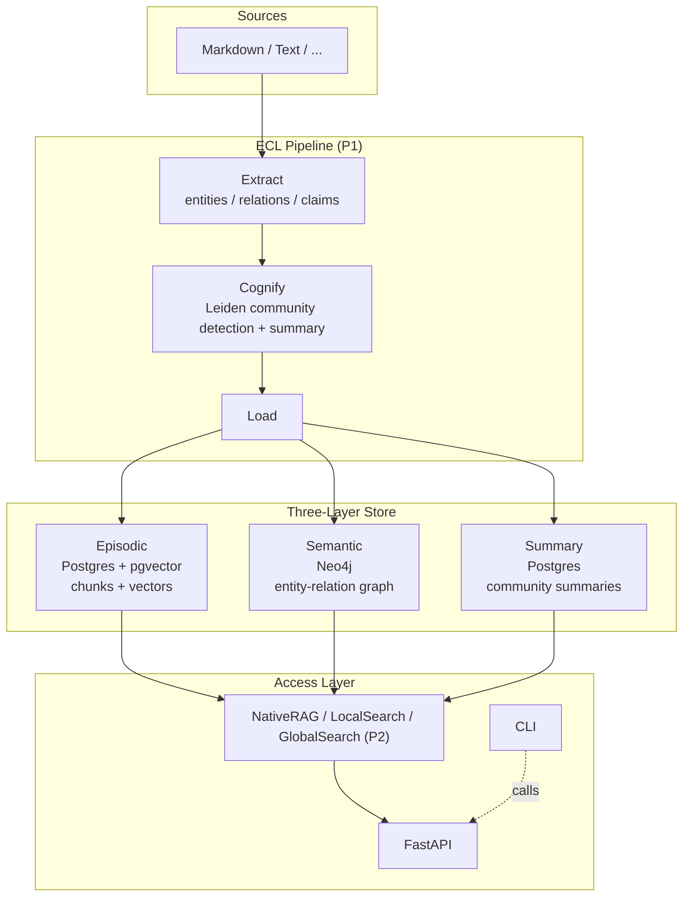
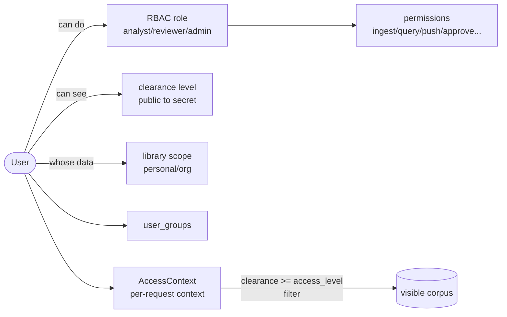

# Calliodesmo

> 三层知识图谱驱动的智能情报分析平台 — GraphRAG 索引基座 + LlamaIndex/LangGraph 检索与 Agent 编排，LLM 与嵌入可切换。

[](docs/plans/roadmap.md)
[](docs/verification/P1-verification.md)
[](pyproject.toml)
[](LICENSE)

Calliodesmo 把原始文档加工成**三层知识图谱**（情景层 / 语义层 / 社区摘要层），支撑从精准检索到全局研判的多层问答，并以**三维正交权限模型**（角色 + 访问等级 + 库范围）和 **Git-like 协作推送**保证多用户情报生产的安全与可追溯。

---

## 为什么用它

- **不只是向量检索** — 同时维护原始文本块、实体关系图、社区摘要三层，支持局部（Local）到全局（Global）的跨层级问答。
- **为情报分析而生** — 内置访问等级（clearance）、审计日志、个人库→组织库的审核合并流程，而非事后补丁。
- **处处可插拔** — LLM / 嵌入 / 向量库 / 图库 / 文档加载六处抽象接口，单机起步，按需扩展到 ≥50 万文档。
- **多后端 LLM** — 经 LiteLLM 统一接入 OpenAI / Qwen / DeepSeek / Ollama 本地，一行配置切换。

> [!note] 当前阶段
> **P1 ECL 管线 MVP 已完成**（多格式解析/抽取/建图/实体消解/社区/落库/ingest CLI）。检索与问答（P2）按 [路线图](docs/plans/roadmap.md) 推进中。

## 架构概览



### 三维正交权限模型



## 项目结构

```
src/calliodesmo/
├── api/          FastAPI 应用（/healthz、/auth/token、/auth/me）
├── auth/         三维权限：models / security(Argon2+JWT) / context / service
├── audit/        审计日志（谁/何时/做了什么/从哪来）
├── db/           异步 SQLAlchemy 引擎与声明式基类
├── interfaces/   六大抽象接口：LLM / Embedding / DocumentLoader ...
├── providers/    默认实现：LiteLLM / BGE-M3 / Hash / 文本加载
├── config.py     pydantic-settings（CALLIODESMO_ 前缀）
└── cli.py        Typer：db init / db seed / serve
scripts/          bootstrap.ps1 / bootstrap.sh（无 Docker 一键引导）
docs/
├── plans/        年/月/周/阶段计划（Obsidian vault）
├── deploy/       原生部署指南
└── verification/ 验证报告（测试内容/技术栈/原理/过程）
```

## 快速开始

前置：安装 [uv](https://docs.astral.sh/uv/getting-started/installation/)（自动准备 Python 3.12）。基础设施（PostgreSQL+pgvector / Neo4j）三选一。

### 路径 A：Docker（省心）

```bash
uv sync                      # 安装依赖
cp .env.example .env         # 配置密钥与连接串
docker compose up -d         # 启动 PostgreSQL+pgvector 与 Neo4j
uv run calliodesmo db init   # 建表
uv run calliodesmo db seed   # 写入默认角色/权限与管理员
uv run calliodesmo serve     # 启动 API：http://127.0.0.1:8000（/healthz、/docs）
```

### 路径 B：原生（无 Docker）

```powershell
.\scripts\bootstrap.ps1            # Windows；-Sqlite 走零依赖开发模式
```

```bash
scripts/bootstrap.sh               # Linux / macOS；--sqlite 走零依赖开发模式
```

PostgreSQL 16 + pgvector 与 Neo4j 的原生安装、systemd/Windows 服务、生产要点见 **[原生部署指南](docs/deploy/native.md)**。

### 路径 C：SQLite 开发模式（零依赖）

P0 全功能可跑（认证/权限/审计/API/CLI），但无向量检索与图库（P1+ 需 Postgres/Neo4j）：

```bash
export CALLIODESMO_DATABASE_URL='sqlite+aiosqlite:///./data/calliodesmo-dev.db'
uv run calliodesmo db init && uv run calliodesmo db seed
```

或直接 `.\scripts\bootstrap.ps1 -Sqlite` / `scripts/bootstrap.sh --sqlite`。

## CLI 参考

| 命令 | 作用 |
| --- | --- |
| `calliodesmo --version` | 显示版本 |
| `calliodesmo db init` | 按 metadata 建表（幂等） |
| `calliodesmo db seed` | 写入内置角色/权限 + 初始管理员（幂等；需设 `CALLIODESMO_ADMIN_PASSWORD`） |
| `calliodesmo serve [--host 0.0.0.0 --port 8000 --reload]` | 启动 API（uvicorn） |

> 均经 `uv run` 前缀执行，如 `uv run calliodesmo serve`。

## API 参考（P0）

| 方法 | 路径 | 说明 |
| --- | --- | --- |
| GET | `/healthz` | 健康检查（无需认证） |
| POST | `/auth/token` | 账号密码换 JWT（OAuth2 密码流） |
| GET | `/auth/me` | 当前用户 AccessContext（权限/scope/组） |

启动后访问 `/docs` 查看交互式 API 文档（Swagger UI）。

## 配置

全部配置经环境变量（前缀 `CALLIODESMO_`）或 `.env` 加载，完整清单见 [`.env.example`](.env.example)。常用项：

| 变量 | 默认值 | 说明 |
| --- | --- | --- |
| `CALLIODESMO_DATABASE_URL` | postgresql+asyncpg://... | 数据库连接串（可改 sqlite+aiosqlite） |
| `CALLIODESMO_JWT_SECRET_KEY` | change-me | **生产必须改**为 ≥32 字节随机串 |
| `CALLIODESMO_JWT_EXPIRE_MINUTES` | 60 | Token 有效期 |
| `CALLIODESMO_LLM_MODEL` | openai/gpt-4o-mini | LiteLLM 模型（可切 qwen/deepseek/ollama/lm-studio/llama.cpp） |
| `CALLIODESMO_LLM_API_KEY` | （空） | LLM 密钥；本地服务（localhost）自动豁免 |
| `CALLIODESMO_LLM_API_BASE` | （空） | LLM 接口地址；指向 localhost 时豁免 key 校验 |
| `CALLIODESMO_EMBEDDING_PROVIDER` | bge-m3 | 嵌入提供方 |

## LLM 后端切换

经 LiteLLM 统一接入，模型格式 `<provider>/<model>`，切换后端只改 `.env` 三行，代码不动。

| 后端 | `LLM_MODEL` | `LLM_API_KEY` | `LLM_API_BASE` |
| --- | --- | --- | --- |
| OpenAI 官方 | `openai/gpt-4o-mini` | `sk-...` | （留空） |
| DeepSeek | `deepseek/deepseek-chat` | `sk-...` | （留空） |
| 通义千问 (Qwen) | `openai/qwen-plus` | `sk-...` | `https://dashscope.aliyuncs.com/compatible-mode/v1` |
| Ollama（本地） | `ollama/qwen2.5` | （留空） | `http://localhost:11434` |
| LM Studio（本地） | `openai/local-model` | 任意非空占位 | `http://localhost:1234/v1` |
| llama.cpp（本地） | `openai/local-model` | 任意非空占位 | `http://localhost:8080/v1` |

> [!tip] 本地豁免
> 当 `CALLIODESMO_LLM_API_BASE` 指向 `localhost` / `127.0.0.1` / `0.0.0.0` / `::1`，或 `LLM_MODEL` 以 `ollama/` / `lm-studio/` 开头时，自动豁免 API key 校验（本地推理服务通常不校验密钥）。仅当指向远端云服务时才强制要求 key。

### LM Studio

1. 在 [LM Studio](https://lmstudio.ai/) 加载模型（如 Qwen2.5、Llama 3）。
2. 启动 **Local Server**（默认 `http://localhost:1234`，OpenAI 兼容）。
3. `.env` 设：

   ```dotenv
   CALLIODESMO_LLM_MODEL=openai/local-model      # 模型名可任意，LM Studio 忽略
   CALLIODESMO_LLM_API_KEY=lm-studio              # 任意非空占位（本地不校验）
   CALLIODESMO_LLM_API_BASE=http://localhost:1234/v1
   ```

### llama.cpp

```bash
./llama-server -m model.gguf --port 8080   # 启动 OpenAI 兼容 server
```

`.env` 设：

```dotenv
CALLIODESMO_LLM_MODEL=openai/local-model
CALLIODESMO_LLM_API_KEY=llama-cpp           # 任意非空占位
CALLIODESMO_LLM_API_BASE=http://localhost:8080/v1
```

### Ollama

```bash
ollama pull qwen2.5
ollama serve    # 默认 http://localhost:11434
```

`.env` 设（Ollama 原生协议，无需 `/v1`）：

```dotenv
CALLIODESMO_LLM_MODEL=ollama/qwen2.5
CALLIODESMO_LLM_API_BASE=http://localhost:11434
```

---
## 开发

```bash
uv sync                         # 安装依赖（含 dev 组）
uv run ruff format .            # 格式化
uv run ruff check .             # 静态检查
uv run pytest -v                # 测试（33 用例，内存 SQLite，无需外部服务）
```

CI（`.github/workflows/ci.yml`）在每次 push/PR 自动执行 ruff + pytest。

### 测试策略

- **隔离**：每用例独立内存 SQLite；`sys.modules` 桩隔离 litellm/uvicorn 等外部依赖——离线可跑。
- **契约优先**：接口测试断言输入映射与输出结构，保证六接口可插拔。
- **幂等**：种子与引导脚本均显式验证可重复执行。

详见 **[P0 验证报告](docs/verification/P0-verification.md)**（测试内容 / 技术栈 / 验证原理 / 验证过程）。

## 路线图

| 阶段 | 内容 | 状态 |
| --- | --- | --- |
| **P0** | 地基脚手架（权限/JWT/审计/三接口/API/CLI/部署） | ✅ 完成 |
| **P1** | ECL 管线 MVP（抽取/建图/社区/落库） | ✅ 完成 |
| P2 | 基础检索与 RAG（里程碑） | ⏳ 下一步 |
| P3 | Web UI | ⏳ |
| P4 | Git-like 协作推送 | ⏳ |
| P5-P9 | 高级检索 / 分析 / Agent / 证据验证 / 规模化 | ⏳ |

完整规划与月/周/阶段计划见 **[实施路线图](docs/plans/roadmap.md)**（Obsidian vault 根为本仓库）。

## 技术栈

| 类别 | 技术 |
| --- | --- |
| 语言 | Python 3.12（uv 管理，hatchling 打包） |
| Web / CLI | FastAPI · uvicorn · Typer |
| 数据 | SQLAlchemy 2.0 (async) · PostgreSQL 16 + pgvector · Neo4j · aiosqlite |
| 认证 | PyJWT · pwdlib + Argon2 |
| LLM / 嵌入 | LiteLLM（多后端可切换）· BGE-M3（本地，可选 extra） |
| 检索 / Agent | LlamaIndex + LangGraph（P2+）· GraphRAG（P1，库形式集成） |
| 质量 | pytest + pytest-asyncio · Ruff · GitHub Actions |

> litellm 钉版 `>=1.85,<1.91`：≥1.93 无 Windows 预编译 wheel（需 Rust/MSVC 工具链）。

## 文档导航

- 📋 [实施路线图](docs/plans/roadmap.md) — P0-P9 年计划
- 📅 [2026-08 月计划](docs/plans/monthly/2026-08.md) / [W31 周计划](docs/plans/weekly/2026-W31.md)
- 📝 [P0 阶段任务计划](docs/plans/phases/P0-scaffolding.md) — bite-sized TDD 步骤
- 🚀 [原生部署指南](docs/deploy/native.md) — 无 Docker 完整部署
- ✅ [P0 验证报告](docs/verification/P0-verification.md)

## License

[AGPL-3.0-or-later](LICENSE)