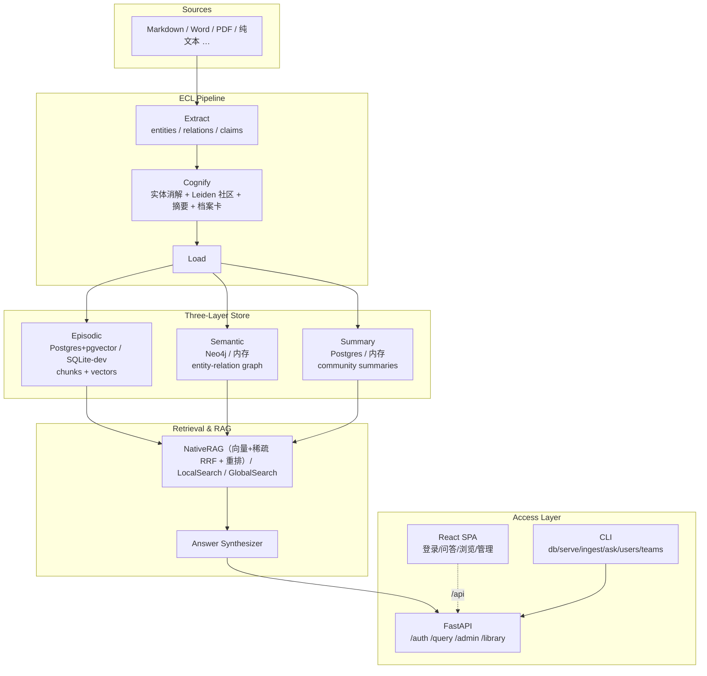
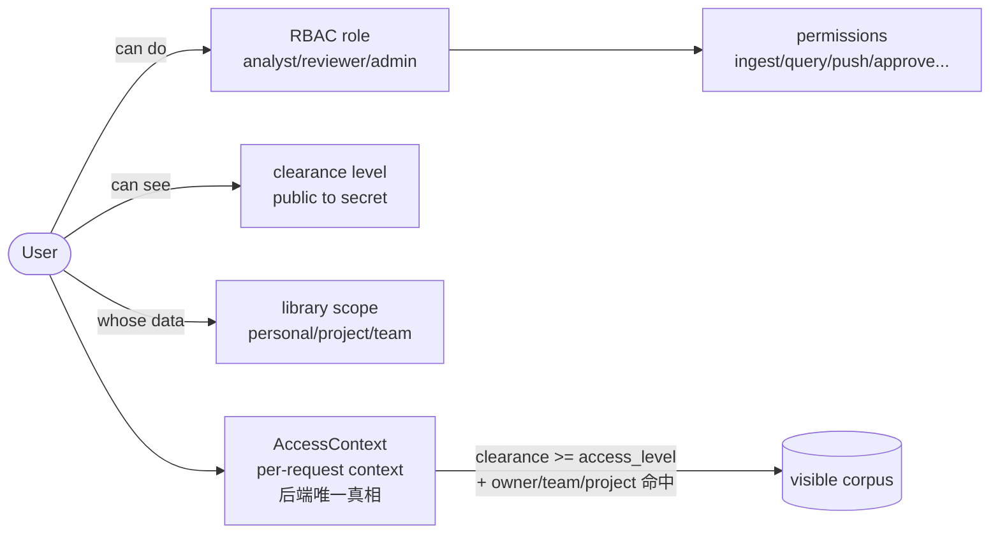

# Calliodesmo

> 三层知识图谱驱动的智能情报分析平台 - GraphRAG 索引基座 + 混合检索与 Agent 编排，LLM / 嵌入 / 重排均可切换。

[](docs/plans/roadmap.md)
[](docs/verification/P3-verification.md)
[](pyproject.toml)
[](LICENSE)

Calliodesmo 把原始文档加工成**三层知识图谱**（情景层 / 语义层 / 社区摘要层），支撑从精准检索到全局研判的多层问答，并以**三维正交权限模型**（角色 + 访问等级 + 库范围）和 **Git-like 协作推送**保证多用户情报生产的安全与可追溯。

> [!note] 当前阶段
> **P3 Web UI 已完成**：登录与会话、个人/组织库浏览、问答面板、用户与团队/项目管理、文档社区手动管理、角色可见性。后端补全 `/admin/*` + `/library/*` + 文档社区手动管理端点，前端为 React 19 SPA（经 Vite dev proxy / 生产 StaticFiles 同源）。检索与重排支持**远端 HTTP 模型**（LLM / 嵌入 / 重排三处均可指向自建服务）。P4 Git-like 协作推送进行中。详见 [路线图](docs/plans/roadmap.md)。

## 5 分钟测试部署（离线、零基础设施）

```bash
uv sync                         # 装依赖
cp .env.example .env            # Windows: copy .env.example .env
# .env 设离线桩（全离线、无需 Postgres/Neo4j/真实模型）：
#   DATABASE_URL=sqlite+aiosqlite:///./data/calliodesmo-dev.db
#   LLM_MODEL=test/stub、EMBEDDING_PROVIDER=hash（DIMENSION=64）、RERANKER_PROVIDER=none
#   ADMIN_PASSWORD=<你的密码>
uv run calliodesmo db init && uv run calliodesmo db seed
uv run calliodesmo serve --seed-demo   # -> http://127.0.0.1:8000，登录 admin/<密码>
```

> 几分钟跑通 API + Web UI + 演示数据。桩模型仅验证管线机制（抽取为写死响应）；真实抽取见下方模型配置。完整测试/生产部署见 [原生部署指南](docs/deploy/native.md)；Docker 全栈见 [Docker 部署指南](docs/deploy/docker.md)。

## 为什么用它

- **不只是向量检索** - 同时维护原始文本块、实体关系图、社区摘要三层，支持局部（Local）到全局（Global）的跨层级问答。
- **为情报分析而生** - 内置访问等级（clearance）、审计日志、个人库→组织库的审核合并流程，而非事后补丁。
- **处处可插拔** - LLM / 嵌入 / 重排 / 向量库 / 图库 / 文档加载六处抽象接口，单机起步，按需扩展到 ≥50 万文档。
- **多后端 LLM / 嵌入 / 重排** - 经 LiteLLM 统一接入 LLM；嵌入与重排支持本地（BGE-M3）或远端 HTTP 服务（llama.cpp / vLLM / TEI 等 OpenAI 兼容 server），一行配置切换。

## 架构概览



### 三维正交权限模型



## 项目结构

```
src/calliodesmo/
├── api/          FastAPI：/healthz、/auth/*、/query、/admin/*、/library/*（含 SPA 静态托管）
├── auth/         三维权限：models / security(Argon2+JWT) / context / service
├── audit/        审计日志（谁/何时/做了什么/从哪来）
├── db/           异步 SQLAlchemy 引擎与声明式基类
├── ecl/          Extract-Cognify-Load 管线（chunker/extractor/cognify/community/load/engine/demo_seed）
├── interfaces/   抽象接口：LLM / Embedding / DocumentLoader / VectorStore / GraphStore / CommunityStore / Retriever ...
├── providers/    默认实现：LiteLLM / BGE-M3 / Hash / 远端 embedding / 各格式加载器 / 内存 stores
├── retrieval/    检索域：hybrid(RRF) / local / global / answer_synthesizer / search_engine / bge_reranker / http_reranker
├── stores/       profile_card_store / visibility
├── eval/         评估 harness：golden(Q&A) / metrics / harness
├── config.py     pydantic-settings（CALLIODESMO_ 前缀）
└── cli.py        Typer：db / serve / ingest / ask / users / teams
frontend/         React 19 + Vite + TS + Tailwind + shadcn/ui（源码拷贝）SPA
scripts/          bootstrap.ps1 / bootstrap.sh（无 Docker 一键引导）
docs/
├── deploy/       原生部署指南（native.md）
├── plans/        年/月/周/阶段计划（Obsidian vault）
└── verification/ 验证报告（P0-P3）
```

## 快速开始

前置：安装 [uv](https://docs.astral.sh/uv/getting-started/installation/)（自动准备 Python 3.12）。基础设施三选一：Docker 全栈 / 原生 Postgres+Neo4j / SQLite 零依赖开发模式。

### 路径 A：Docker（省心，一键全栈）

```bash
cp .env.example .env         # 配置密钥；设 CALLIODESMO_ADMIN_PASSWORD 启用初始管理员
docker compose up -d --build # 起 PostgreSQL+pgvector + Neo4j + app（app 自动 db init/seed/serve）
```

启动后访问 http://127.0.0.1:8000/（生产静态托管 SPA）或 `/docs`。容器内连接串已由 compose 覆盖为服务名。

```bash
docker compose logs -f app                                # 跟踪应用日志
docker compose exec app calliodesmo ingest /app/data/docs # 建图（文档放 ./data/docs）
```

### 路径 B：原生（无 Docker）

```bash
uv sync                      # 安装依赖
cp .env.example .env         # 按需改密钥与连接串
uv run calliodesmo db init   # 建表（幂等）
uv run calliodesmo db seed   # 内置角色/权限 + 初始管理员（先设 CALLIODESMO_ADMIN_PASSWORD）
uv run calliodesmo serve     # 启动 API + SPA：http://127.0.0.1:8000
```

基础设施（PostgreSQL 16 + pgvector、Neo4j）的原生安装见 **[原生部署指南](docs/deploy/native.md)**。

### 路径 C：SQLite 零依赖开发模式

无需 Postgres/Neo4j，P0 全功能可跑（认证/权限/审计/CLI/API/UI）；向量检索与图库降级为内存实现，适合本地开发与冒烟：

```bash
export CALLIODESMO_DATABASE_URL='sqlite+aiosqlite:///./data/calliodesmo-dev.db'  # Windows: $env:...
# 或一键：scripts/bootstrap.ps1 -Sqlite  /  scripts/bootstrap.sh --sqlite
uv run calliodesmo db init && uv run calliodesmo db seed
```

### 演示数据（serve --seed-demo）

内存 stores 模式下 CLI `ingest`（独立进程）灌的数据 API 进程不可见，故演示数据统一走 serve 进程内自灌：

```bash
uv run calliodesmo serve --seed-demo   # 启动前对 data/demo/ 跑 ECL 注入内存 stores 单例；产物落盘 seed-cache.json，二次启动命中缓存跳过 LLM
```

`data/demo/` 文档按文件名前缀拉开 clearance 梯度（`public__*` / `internal__*` / `confidential__*`），供权限矩阵回归与可见性隔离演示。指向自定义语料可设 `CALLIODESMO_DEMO_DIR`。

## 部署：模型配置（三层可切换）

LLM / 嵌入 / 重排三层均可本地或远端，**只改 `.env` 不动代码**。下表为三层配置总览（详见 `.env.example`）：

| 层 | 配置项 | 取值 | 说明 |
| --- | --- | --- | --- |
| **LLM** | `LLM_MODEL` / `LLM_API_KEY` / `LLM_API_BASE` | LiteLLM `<provider>/<model>` | 经 LiteLLM 统一接入；`test/stub` 为离线桩；本地（localhost）自动豁免 key |
| **嵌入** | `EMBEDDING_PROVIDER` / `EMBEDDING_API_BASE` / `EMBEDDING_MODEL` / `EMBEDDING_DIMENSION` | `hash` / `bge-m3` / `remote` | `hash` 离线桩；`bge-m3` 本地（需 `uv sync --extra embedding-local`）；`remote` 指 OpenAI 兼容嵌入服务 |
| **重排** | `RERANKER_PROVIDER` / `RERANKER_API_BASE` / `RERANKER_MODEL` / `RERANKER_API_KEY` | `none` / `local` / `remote` | `none` 保序降级（默认）；`local` 本地 BGE 交叉编码器（需 `--extra search-rerank`）；`remote` 指 llama.cpp `/rerank` 等服务 |

### LLM 后端切换

| 后端 | `LLM_MODEL` | `LLM_API_KEY` | `LLM_API_BASE` |
| --- | --- | --- | --- |
| OpenAI 官方 | `openai/gpt-4o-mini` | `sk-...` | （留空） |
| DeepSeek | `deepseek/deepseek-chat` | `sk-...` | （留空） |
| 通义千问 (Qwen) | `openai/qwen-plus` | `sk-...` | `https://dashscope.aliyuncs.com/compatible-mode/v1` |
| Ollama（本地） | `ollama/qwen2.5` | （留空） | `http://localhost:11434` |
| LM Studio（本地） | `openai/local-model` | 任意非空占位 | `http://localhost:1234/v1` |
| llama.cpp（本地/远端） | `openai/local-model` | 任意非空占位 | `http://<host>:<port>/v1` |

> [!tip] 本地豁免
> 当 `LLM_API_BASE` 指向 `localhost` / `127.0.0.1` / `0.0.0.0` / `::1`，或 `LLM_MODEL` 以 `ollama/` / `lm-studio/` 开头时，自动豁免 API key 校验。指向非 localhost 的自建服务（如局域网 llama.cpp）时，填任意非空 `LLM_API_KEY` 即可（服务通常不校验）。

### 远端嵌入 / 重排（自建 OpenAI 兼容服务）

适合已部署 BGE-M3 / bge-reranker-v2-m3 的场景（如 `llama-server --embeddings` / `llama-server --rerank`），无需本地重依赖：

```dotenv
# 嵌入：远端 bge-m3
CALLIODESMO_EMBEDDING_PROVIDER=remote
CALLIODESMO_EMBEDDING_API_BASE=http://<embed-host>:8082   # 无需带 /v1，会自动补
CALLIODESMO_EMBEDDING_MODEL=bge-m3
CALLIODESMO_EMBEDDING_DIMENSION=1024

# 重排：远端 bge-reranker-v2-m3（llama.cpp /rerank）
CALLIODESMO_RERANKER_PROVIDER=remote
CALLIODESMO_RERANKER_API_BASE=http://<rerank-host>:8083
CALLIODESMO_RERANKER_MODEL=BAAI/bge-reranker-v2-m3
CALLIODESMO_RERANKER_API_KEY=
```

> [!note] 三层独立
> LLM / 嵌入 / 重排可分别选本地或远端，互不耦合。例如 LLM 用云端 OpenAI、嵌入与重排用局域网自建 BGE 服务。`RERANKER_PROVIDER=none` 时查询走保序降级，不报错。

## 部署：生产要点

- **进程管理**：Linux 用 systemd 托管 `uv run calliodesmo serve --host 127.0.0.1 --port 8000`（uvicorn 可加 `--workers`）；Windows 用 NSSM / 任务计划。
- **反向代理**：Nginx/Caddy 终结 TLS，转发到 127.0.0.1:8000；生产前端由 FastAPI `StaticFiles` 同源托管，开发用 Vite dev server（5173）经 `/api` proxy 转发。
- **密钥**：`CALLIODESMO_JWT_SECRET_KEY` 用 ≥32 字节随机串；`.env` 权限 600，绝不入库（`.gitignore` 已覆盖）。
- **会话**：JWT 经 httpOnly + SameSite=Lax cookie 下发（防 XSS 读 token）；无 refresh token，过期 401 重登；`allow_self_register` 默认关。
- **备份**：`pg_dump`（Postgres）+ `neo4j-admin database dump`（Neo4j）。
- **升级**：`uv sync --upgrade-package <pkg>` 后跑 `uv run pytest` 回归。

## 开发

```bash
uv sync                         # 安装依赖（含 dev 组）
uv run ruff format .            # 格式化
uv run ruff check .             # 静态检查
uv run pytest -v                # 测试（289 用例，内存 SQLite，离线可跑）
```

前端（`frontend/`，独立 npm 工程）：

```bash
cd frontend && npm ci
npm run dev        # Vite dev server（5173），/api 经 proxy 转 8000
npm run build      # 产出 dist/，由 FastAPI StaticFiles 同源托管
npm test           # vitest
```

CI（`.github/workflows/ci.yml`）在每次 push/PR 自动执行 ruff + pytest（后端）与 npm ci/build/vitest（前端）。

### 测试策略

- **隔离**：每用例独立内存 SQLite；`sys.modules` 桩隔离 litellm/uvicorn 等外部依赖--离线可跑。
- **契约优先**：接口测试断言输入映射与输出结构，保证可插拔。
- **幂等**：种子与引导脚本均显式验证可重复执行。
- **权限矩阵**：`/query` `/admin/*` `/library/*` 受限端点做参数化矩阵（3 角色 × 端点），断言与 `DEFAULT_ROLE_PERMISSIONS` 对齐。

详见 **[P3 验证报告](docs/verification/P3-verification.md)**。

## 路线图

| 阶段 | 内容 | 状态 |
| --- | --- | --- |
| **P0** | 地基脚手架（权限/JWT/审计/接口/API/CLI/部署） | ✅ 完成 |
| **P1** | ECL 管线 MVP（抽取/建图/社区/落库/ingest CLI） | ✅ 完成 |
| **P2** | 基础检索与 RAG（三模式 + RRF 混合 + 重排 + 评估 + /query） | ✅ 完成 |
| **P3** | Web UI（React SPA + 管理/浏览后端补全 + 权限矩阵回归） | ✅ 完成 |
| P4 | Git-like 协作推送 | ⏳ 进行中 |
| P5-P9 | 高级检索 / 分析 / Agent / 证据验证 / 规模化 | ⏳ |

完整规划与月/周/阶段计划见 **[实施路线图](docs/plans/roadmap.md)**（Obsidian vault 根为本仓库）。

## 技术栈

| 类别 | 技术 |
| --- | --- |
| 语言 | Python 3.12（uv 管理，hatchling 打包） |
| 后端 | FastAPI · uvicorn · Typer · SQLAlchemy 2.0 (async) |
| 数据 | PostgreSQL 16 + pgvector · Neo4j · aiosqlite（开发降级） |
| 前端 | React 19 · Vite · TypeScript · Tailwind CSS · shadcn/ui（源码拷贝）· TanStack Query · React Router |
| 认证 | PyJWT · pwdlib + Argon2（httpOnly cookie 会话） |
| LLM / 嵌入 / 重排 | LiteLLM（多后端）· BGE-M3（本地 extra）/ 远端 HTTP · bge-reranker-v2-m3（本地 / 远端 HTTP） |
| 检索 / Agent | GraphRAG（库形式）· LlamaIndex + LangGraph（P5+） |
| 质量 | pytest + pytest-asyncio · vitest · Ruff · GitHub Actions |

> litellm 钉版 `>=1.85,<1.91`：≥1.93 无 Windows 预编译 wheel（需 Rust/MSVC 工具链）。升级前确认 wheel 可用性。

## 文档导航

- 📋 [实施路线图](docs/plans/roadmap.md) - P0-P9 年计划
- 🚀 [原生部署指南](docs/deploy/native.md) - 测试/开发 + 生产原生部署（按步骤）
- 🐳 [Docker 部署指南](docs/deploy/docker.md) - 一键全栈（Postgres+pgvector / Neo4j / app）
- ✅ [P3 验证报告](docs/verification/P3-verification.md) - Web UI 验证（289 passed）
- 📝 [阶段任务计划](docs/plans/phases/) - P0-P3 bite-sized TDD 步骤

## License

[AGPL-3.0-or-later](LICENSE)